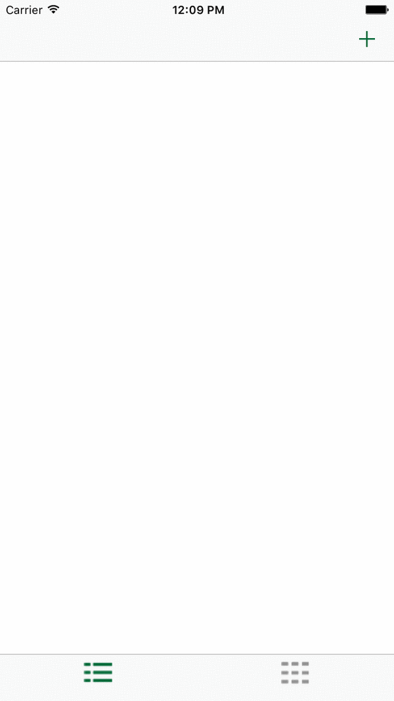

# MemeMeV2.0
Project2 of the iOS Swift nanodegree

App that enables a user to take a picture, and add text at the top and bottom to form a meme, and share that meme on Facebook and Twitter and also by SMS or email. In this project, sent memes will appear in a tab view with two tabs: a table view and a collection view.

Project key poitns:

-Set up a navigation structure that creates an intuitive flow through the app.

-Build tables with datasources and delegates.

-Create custom table view cells.

-Implement user interfaces with tab views and collection views.

